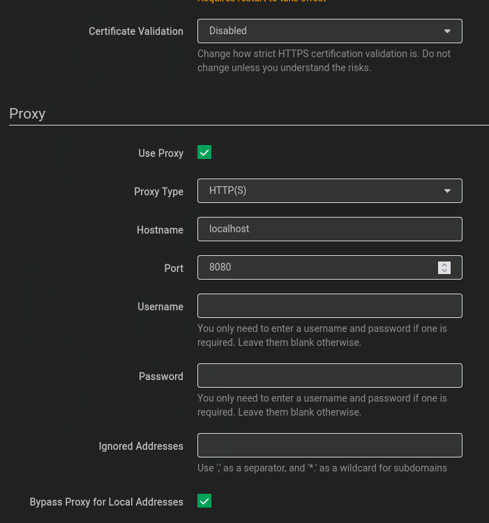

 
<h1>Lidarr++Deemix</h1>
<h4 style="font-style: italic">"If Lidarr and Deemix had a child"</h4>

## 💡 How it works

Lidarr usually pulls artist and album infos from their own api api.lidarr.audio, which pulls the data from MusicBrainz.

However, MusicBrainz does not have many artists/albums, especially for some regional _niche_ artist.

This tool helps to enrich Lidarr, by providing a custom proxy, that _hooks into_ the process _without modifying Lidarr itself_, and **_injects additional artists/albums from deemix_**.

#### To do that, the following steps are performed:

- [mitmproxy](https://mitmproxy.org/) runs as a proxy
- Lidarr needs to be configured to use that proxy.
- The proxy then **_redirects all_** api.lidarr.audio calls to an internally running **NodeJS service** (_127.0.0.1:7171_)
- That NodeJS service **enriches** the missing artists/albums with the ones found in deemix
- Lidarr has now additiona artists/albums, and can do its thing.

## 💻️ Installation

> [!CAUTION]
> If you have installed an older version, please adjust the Proxy settings as described below, otherwise the HTTP-requests will fail

> [!WARNING]
> This image does not come with Lidarr nor with the deemix-gui. It's an addition to your existing setup.

> [!NOTE]
> The previous setup required to map additional volumes for certificate validation. Thx to @codefaux, here's now a simpler way for installation.

- Use the provided [docker-compose.yml](./docker-compose.yml) as an example.
  - **DEEMIX_ARL=xxx** your deezer ARL (get it from your browsers cookies)
  - **PRIO_DEEMIX=true** If albums with the same name exist, prioritize the ones comming from deemix
  - **OVERRIDE_MB=true** override MusicBrainz completely - **WARNING!** This will delete all your artists/albums imported from MusicBrainz.
- Go to **Lidarr -> Settings -> General**
  - **Certificate Validation:** to _Disabled_
  - **Use Proxy:** ✅
  - **Proxy Type:** HTTP(S)
  - **Hostname:** container-name/IP of the machine where lidarr-deemix is running
  - **Port:** 8080 (if using container-name), otherwise the port you exposed the service to
  - **Bypass Proxy for local addresses:** ✅

> [!NOTE]
> The folder `/lidarr-deemix-certs` must be mounted to `/usr/local/share/ca-certificates` within the Lidarr container.

> Also `/var/run/docker.sock/` is needed, so lidarr-deemix can connect to lidarr and execute `update-ca-certificates`. If this is an issue, you have to manually execute that command, each time you restart the Lidarr container.
